# Web Canvas

## Demo Link
https://koola025.github.io/Web-Canvas/
## Functions
### Basic Components
* Basic control tools
    * Brush and eraser
        
        Brush with different color, size and opacity.

        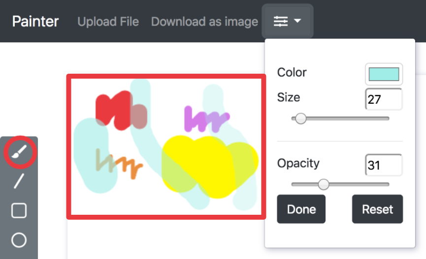
        
        Eraser with different size and opacity.
        
        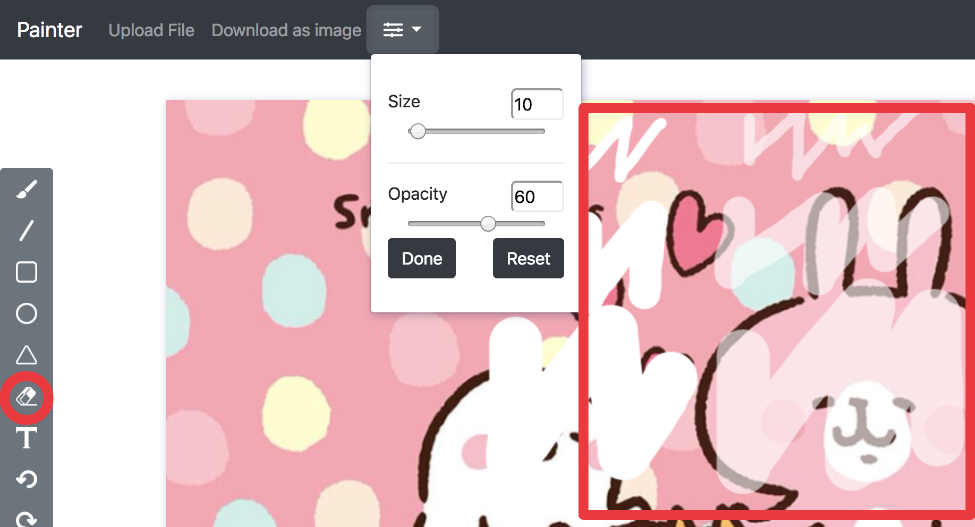
    * Color selector
    
        User can choose color for fill and color for border from the menu.
        
        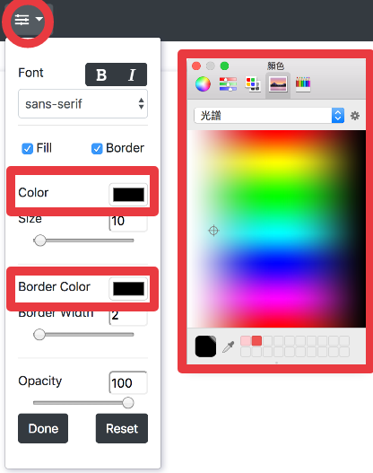
    * Simple menu 
        
        This dropdown menu includes all kinds of attributes, including fonts, sizes, colors, opacity...etc.
        
        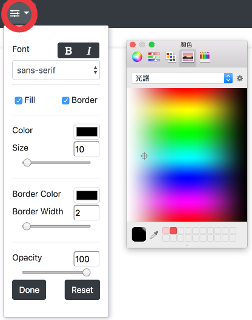
* Text input
    * User can type texts on canvas
        
        User can click on the position they like to place their text and enter the letters. After pressing enter, the text will display on canvas.

        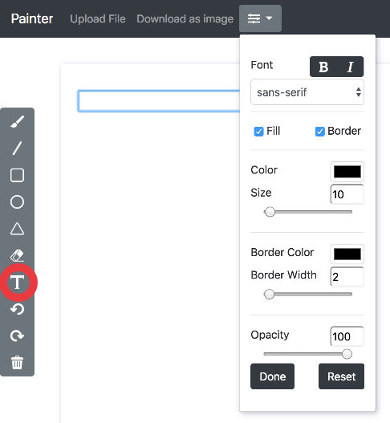
    * Font menu
        
        User can choose font, size, color, bold or italic, with or without border, with or without fill, border width, border color, opacity from this menu.
        
        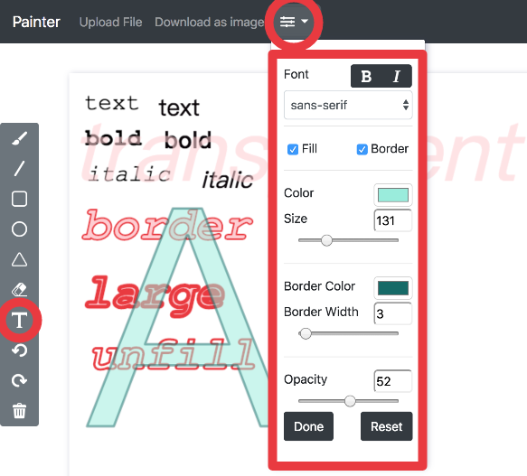
* Cursor icon
    * The image should change according to the currently used tool
        1. When choosing brush tool or eraser, the cursor changes to "pointer". 
        2. When choosing line, circle, rectangle, triangle tool, the cursor changes to "crosshair".
        3. When choosing text tool, the cursor changes to "text".
    
* Refresh button
    * Reset canvas
        1. The trash can button clears the canvas and sets it to original size.
        2. The reset button resets all attributes on the menu to default value.
        
        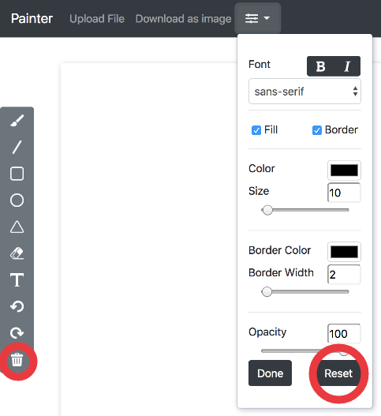

### Advance Tools
* Different brush shapes
    * Line, circle, rectangle and triangle

        With these four buttons and the choices in the menu, user can draw different shapes with different colors and opacity. Besides, users can also choose to draw it with or without border and color fill.
        
        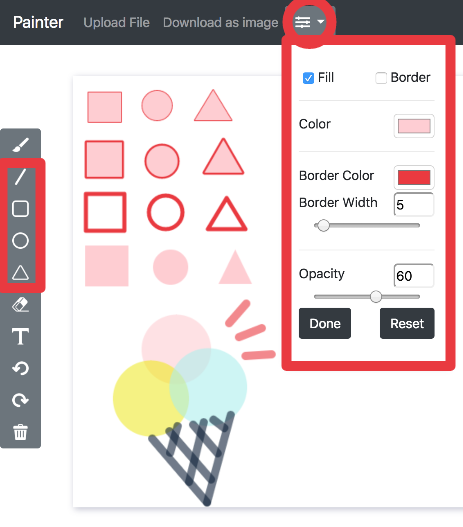
* Un/Re-do button
    * Undo, Redo

        The one on the top is the undo button, and the one on the bottom is redo button.
        
        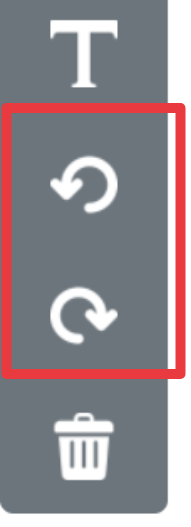
* Image tool
    * Users can upload image and paste it
        
        User can choose image from computer and the canvas will resize to the size of the image while remaining in the border of screen.

        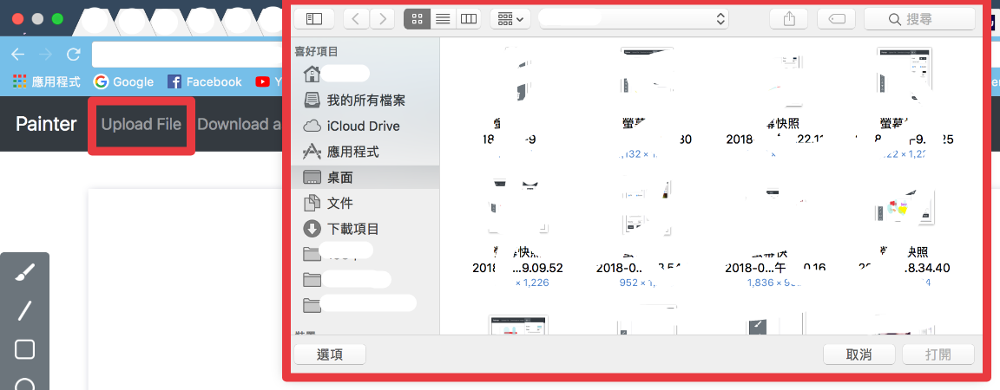
        
        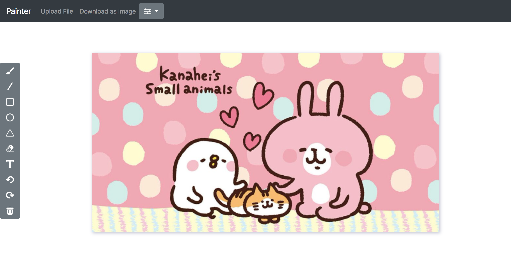
        
        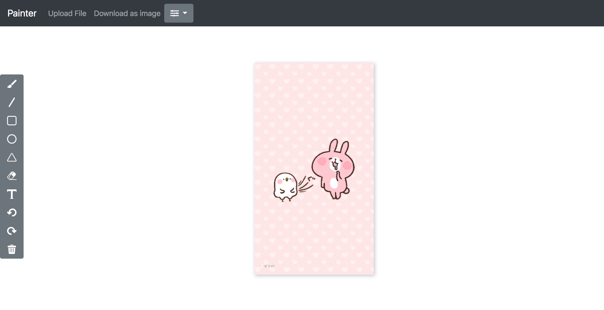
* Download
    * Download current canvas as an image file
        
        Pressing the button below will download current canvas as an image file.        

        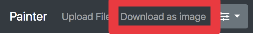
        
### Others

* Dynamic menu
    
    The menu shows and hides different attributes when different tools are chosen.

* Fill/Border

    User can check whether they want fill and border on the menu for all shapes and text.
    
* Opacity

    User can change the opacity of text, shapes, brushes, eraser.

* Scroll toolbar

    When the screen height is too small, you can still scroll the tool bar too see all attributes.
    
* Put into practice

    All demo pictures in this mackdown file are drawn with this painter.
